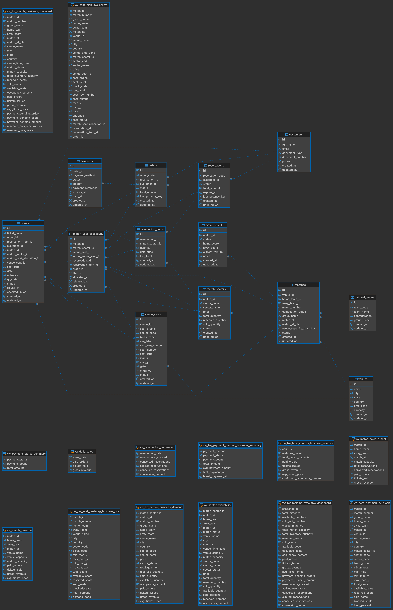

# Copa Ticketing MVP - FIFA World Cup 2026

Aplicacao demo de venda de ingressos para a Copa 2026, com fluxo completo de cliente, painel operacional, recomendacoes com OCI Generative AI, analiticos com MySQL HeatWave e deploy na OCI com Terraform + OKE.


## Visao Geral

| Modulo | Stack | Porta |
|--------|-------|-------|
| `backend/` | Java 25, Helidon SE 4.2, HikariCP, MySQL Connector/J, OCI GenAI, HeatWave NL_SQL | 8080 |
| `frontend/` | Java 25, Vaadin Flow 24.10, Spring Boot 3.5, Spring Security | 8081 |
| `infra/` | Terraform, OCI OKE, OCIR, Kubernetes manifests, Podman | 80 via Load Balancer |

O backend expoe APIs REST com Basic Auth. O frontend Vaadin consome essas APIs usando as credenciais configuradas no ambiente. A infraestrutura cria rede publica de demo, cluster OKE, node pool, repositorios OCIR e manifests Kubernetes para publicar backend e frontend.

> Esta infraestrutura foi pensada para demonstracao. Ela usa rede publica e regras permissivas; revise seguranca, IAM, secrets, banco, backup, observabilidade e rede antes de qualquer uso de producao.

## Live Demo
[Link Público](http://170.9.244.136/)

## Features Atuais

### Cliente

- Catalogo de partidas com filtros por cidade, data e selecao.
- Detalhe da partida com setores disponiveis.
- Mapa de assentos paginado, por fileira ou completo por setor.
- Reserva temporaria de assentos com expiracao configuravel.
- Checkout com Pix simulado e confirmacao de pagamento.
- Emissao de tickets digitais apos pagamento.
- Consulta de ingressos por documento.
- Recomendacao de partidas por times favoritos e cidades usando OCI Generative AI.

### Operacao / Admin

- Login administrativo no frontend em `/admin-login`.
- Dashboard operacional com KPIs, partidas de destaque e resumo de pagamentos.
- Grid de pedidos com paginacao e filtro por status.
- Estoque por partida, ocupacao e receita.
- Analiticos HeatWave com leituras em views de negocio e hint `SET_VAR(use_secondary_engine=FORCED)`.
- Tela `HeatWave NL_SQL` para perguntas em linguagem natural sobre views analiticas autorizadas.
- Guardrails no NL_SQL: somente `SELECT`, views permitidas, bloqueio de DDL/DML, schema validado e `LIMIT 100` quando necessario.
- Tela `Demonstração ao Vivo` para simular sellout real por partida, acompanhar lotes, status mix, progresso por setor e atualizar dashboards HeatWave ao vivo.

### Infraestrutura

- Terraform para VCN, Internet Gateway, subnets publicas, cluster OKE, node pool gerenciado e repositorios OCIR.
- Scripts para aplicar Terraform, buildar imagens com Podman, fazer push no OCIR, renderizar manifests e publicar no Kubernetes.
- Deploy com 2 replicas para backend e frontend, probes, pull secret do OCIR e `Service` publico `LoadBalancer` para o frontend.

## Pre-requisitos

- Oracle GraalVM for JDK 25 ou OpenJDK 25 para modo JIT.
- Maven 3.9+.
- MySQL 8+ com o schema/tabelas/views da demo.
- Para as telas de HeatWave: MySQL HeatWave com as views analiticas carregadas e, para NL_SQL, suporte a `sys.NL_SQL`.
- Para recomendacoes: OCI Generative AI API key e um modelo de chat disponivel na regiao da chave.
- Para deploy em OCI: Terraform 1.6+, OCI CLI, kubectl, Podman, `envsubst` e uma conta OCI com permissoes para OKE, VCN, Load Balancer e OCIR.

## Configuracao Local

As aplicacoes carregam `.env` automaticamente quando executadas dentro de `backend/` ou `frontend/`. Tambem e possivel apontar um arquivo especifico com `COPA_ENV_FILE`.

### Backend - `backend/.env`

```bash
cd backend
cp .env.example .env
```

Campos principais:

```text
BACKEND_PORT=8080
DB_URL=jdbc:mysql://HOST:3306/copa_ticketing?serverTimezone=UTC&useSSL=false&allowPublicKeyRetrieval=true
DB_USER=copa_user
DB_PASS='changeme'
DB_POOL_SIZE=20

ADMIN_USER=admin
ADMIN_PASS=changeme
CUSTOMER_USER=customer
CUSTOMER_PASS=changeme

OCI_GENAI_API_KEY=sk-xxxxxxxxxxxxxxxxxxxxxxxxxxxxxxxx
OCI_GENAI_MODEL_ID=meta.llama-3.3-70b-instruct
HEATWAVE_NL_SQL_MODEL_ID=cohere.command-r-plus-08-2024
```

Observacoes importantes:

- Sem `OCI_GENAI_API_KEY`, a API de recomendacoes retorna que GenAI nao esta configurado.
- O dashboard HeatWave usa as views no database definido por `DB_URL`.
- O servico NL_SQL esta configurado para usar o schema `copa_ticketing_demo`; mantenha as views nesse schema para a demo completa ou ajuste o codigo se o seu banco usa outro nome.

### Frontend - `frontend/.env`

```bash
cd frontend
cp .env.example .env
```

Campos principais:

```text
FRONTEND_PORT=8081
BACKEND_URL=http://localhost:8080
BACKEND_CUSTOMER_USER=customer
BACKEND_CUSTOMER_PASS=changeme
BACKEND_ADMIN_USER=admin
BACKEND_ADMIN_PASS=changeme
```

## Executar Localmente

### Backend

```bash
cd backend
mvn package -DskipTests
java --enable-preview -jar target/copa-backend-1.0.0.jar
```

Health check:

```bash
curl http://localhost:8080/health
```

### Frontend

```bash
cd frontend
mvn spring-boot:run
```

Acesse:

```text
http://localhost:8081
```

## Build de Producao

### Frontend JAR

O profile `production` gera o bundle Vaadin/Vite e empacota o JAR sem dependencias de desenvolvimento.

```bash
cd frontend
mvn clean -Pproduction -DskipTests package
java --enable-preview -jar target/copa-frontend-1.0.0.jar
```

### Native Image

Backend:

```bash
cd backend
mvn package -Pnative-image -DskipTests
./target/copa-backend
```

Frontend:

```bash
cd frontend
mvn clean package -Pproduction,native -DskipTests
./target/copa-frontend
```

## Rotas do Frontend

| Rota | Descricao |
|------|-----------|
| `/` | Catalogo de partidas e recomendacoes por IA |
| `/match/:id` | Detalhe da partida |
| `/match/:id/seats/:sector` | Mapa de assentos |
| `/checkout` | Reserva, checkout e Pix simulado |
| `/tickets` | Consulta de tickets por documento |
| `/admin-login` | Login administrativo |
| `/admin/dashboard` | KPIs operacionais |
| `/admin/orders` | Pedidos |
| `/admin/inventory` | Estoque |
| `/admin/nl-sql` | Perguntas em linguagem natural via HeatWave NL_SQL |
| `/admin/live` | Demonstracao ao vivo / sellout |

## Endpoints da API

O frontend envia Basic Auth nas chamadas para o backend. Use `CUSTOMER_USER:CUSTOMER_PASS` no fluxo publico e `ADMIN_USER:ADMIN_PASS` nas rotas de administracao e HeatWave.

### Publico

| Metodo | Endpoint | Descricao |
|--------|----------|-----------|
| GET | `/api/public/matches?city=&date=&team=&page=0&size=20` | Catalogo de partidas com filtros e paginacao |
| GET | `/api/public/matches/{id}` | Detalhe de uma partida |
| GET | `/api/public/matches/{id}/sectors` | Setores disponiveis por partida |
| GET | `/api/public/matches/{id}/seat-map/rows?sector=A` | Resumo de fileiras do mapa de assentos |
| GET | `/api/public/matches/{id}/seat-map?sector=A&page=0&size=50` | Assentos paginados |
| GET | `/api/public/matches/{id}/seat-map?sector=A&row=12` | Assentos de uma fileira |
| GET | `/api/public/matches/{id}/seat-map?sector=A&all=true` | Todos os assentos de um setor |
| POST | `/api/public/reservations` | Criar reserva temporaria |
| POST | `/api/public/reservations/{code}/checkout` | Gerar order e Pix simulado |
| POST | `/api/public/payments/{ref}/confirm` | Confirmar Pix e emitir tickets |
| GET | `/api/public/customers/{doc}/tickets` | Tickets por documento |
| POST | `/api/public/recommendations` | Recomendacoes com OCI GenAI |

Body de reserva:

```json
{
  "fullName": "Joao Silva",
  "email": "joao@exemplo.com",
  "documentType": "CPF",
  "documentNumber": "123.456.789-00",
  "phone": "+55 11 99999-9999",
  "matchId": 1,
  "matchSectorId": 5,
  "unitPrice": 250.00,
  "seatIds": [101, 102]
}
```

Body de recomendacao:

```json
{
  "favoriteTeams": ["Brazil", "Portugal"],
  "cities": ["Miami", "Toronto"]
}
```

### Admin

Rotas administrativas exigem usuario com role `ADMIN`.

| Metodo | Endpoint | Descricao |
|--------|----------|-----------|
| GET | `/api/admin/dashboard` | KPIs, top partidas e vendas |
| GET | `/api/admin/orders?page=0&size=20&status=PAID` | Pedidos com paginacao |
| GET | `/api/admin/inventory?matchId=1` | Estoque por partida |
| GET | `/api/admin/payment-summary` | Resumo de pagamentos |
| GET | `/api/admin/heatwave/analytics` | Pacote analitico HeatWave |
| GET | `/api/admin/matches/options` | Partidas disponiveis para simulacao |
| GET | `/api/admin/sellout/status?matchNumber=68` | Status da simulacao de sellout |
| GET | `/api/admin/dashboard/status` | Dashboard ao vivo consolidado |
| POST | `/api/admin/sellout/start` | Iniciar sellout por partida |
| POST | `/api/admin/sellout/reset` | Apagar dados gerados pela demo |
| POST | `/api/heatwave/nl-sql` | Perguntar em linguagem natural para o HeatWave NL_SQL |

Body para iniciar sellout:

```json
{
  "matchNumber": 68,
  "orderSize": 4,
  "batchOrders": 1000,
  "maxSeats": 0,
  "statusMix": {
    "reservedPercent": 0,
    "paymentPendingPercent": 0,
    "issuedPercent": 100
  }
}
```

Body NL_SQL:

```json
{
  "question": "Quais jogos geraram mais receita?",
  "questionId": "jogos_receita"
}
```

### Operacao

| Metodo | Endpoint | Descricao |
|--------|----------|-----------|
| GET | `/health` | Health check usado por probes e testes rapidos |

## Fluxo do Usuario

```text
Catalogo -> Recomendacao IA opcional -> Detalhe -> Setor -> Mapa de assentos
  -> Reserva -> Checkout -> Pix simulado -> Confirmacao -> Tickets digitais
```

## Painel Admin

```text
Login admin -> Dashboard -> Pedidos / Estoque / HeatWave NL_SQL / Demonstracao ao vivo
```

Use as credenciais `ADMIN_USER` e `ADMIN_PASS` configuradas no backend/frontend.

## Resumo Do Resumo: Subir Com Terraform Em `infra/`

O caminho curto para publicar a aplicacao na OCI e este:

1. Entrar em `infra/` e criar o ambiente:

```bash
cd infra
cp .env.example .env
```

2. Preencher `infra/.env` com:

```text
TF_VAR_region
TF_VAR_tenancy_ocid
TF_VAR_compartment_ocid
TF_VAR_user_ocid
TF_VAR_fingerprint
TF_VAR_private_key_path
OCIR_USERNAME
OCIR_AUTH_TOKEN
DB_URL
DB_USER
DB_PASS
OCI_GENAI_API_KEY
OCI_GENAI_MODEL_ID
HEATWAVE_NL_SQL_MODEL_ID
K8S_NAMESPACE
```

3. Executar os scripts em sequencia:

```bash
source .env
./scripts/01_apply_terraform.sh
./scripts/02_build_and_push_images.sh
./scripts/03_deploy_k8s.sh
```

4. Pegar o IP publico do frontend:

```bash
export KUBECONFIG="$(pwd)/generated/kubeconfig"
kubectl -n "$K8S_NAMESPACE" get svc copa-frontend-lb
```

Quando `EXTERNAL-IP` aparecer, acesse:

```text
http://<EXTERNAL-IP>/
```

5. Para destruir a demo:

```bash
source .env
./scripts/99_destroy.sh
```

O Terraform cria VCN, subnets publicas, OKE, node pool e repositorios OCIR. Os scripts seguintes fazem login no OCIR, build/push das imagens, criam secrets, aplicam deployments/services e expõem o frontend por Load Balancer. O passo a passo completo fica em [`infra/README.md`](infra/README.md).

## Tema Visual

Paleta Copa do Mundo 2026:

| Cor | Hex | Uso |
|-----|-----|-----|
| Verde Mexico | `#006847` | Primary / botoes / sucesso |
| Azul USA | `#002868` | Titulos / superficies escuras |
| Vermelho Canada | `#C8102E` | Destaques / erros |
| Dourado FIFA | `#FFD100` | Accent / receita / KPIs |

## Performance E Operacao

- Paginacao server-side em listas e grids.
- `LIMIT/OFFSET` e `COUNT(*)` nas consultas paginadas.
- HikariCP com pool configuravel por `DB_POOL_SIZE`.
- Cache HTTP curto em endpoints de catalogo.
- Queries HeatWave com `SET_VAR(use_secondary_engine=FORCED)`.
- Cache de 2 segundos no pacote analitico HeatWave usado pela demo ao vivo.
- Deploy Kubernetes com replicas, probes, rollout restart opcional e diagnostico automatico quando o rollout falha.


## MySQL Tables
 